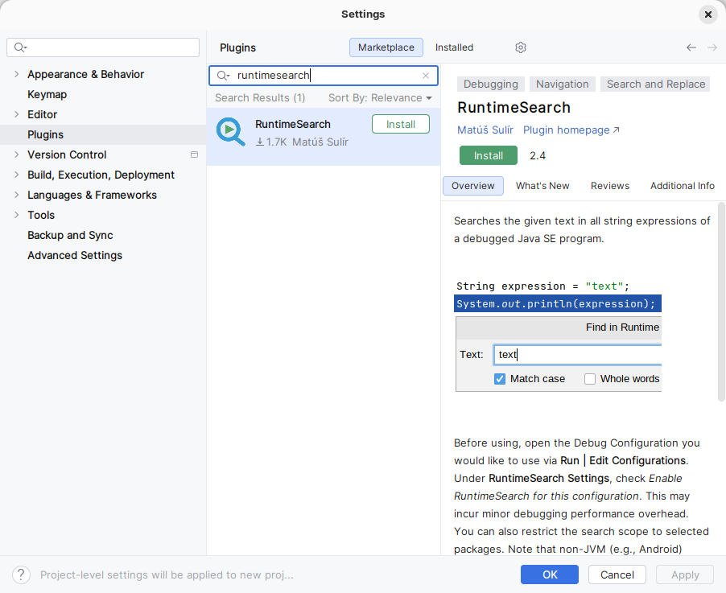
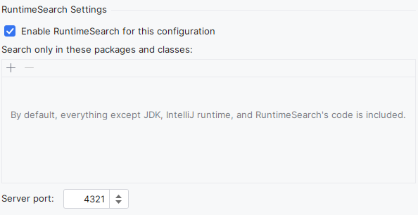
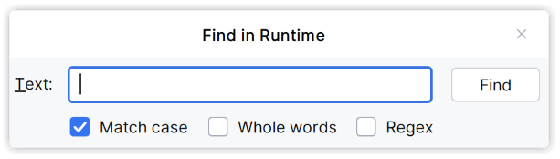

RuntimeSearch is a debugger extension that searches for the given text in the values of all string expressions in a running Java program.

## Video

**Note for plugin users:** The "Find in Runtime" action was moved from the *Navigate* menu to the **Run** menu.

<video width="960" height="540" controls>
  <source src="video.mp4" type="video/mp4">
</video>

## How does it work?

RuntimeSearch consists of two parts: a Java instrumentation agent and an IntelliJ IDEA plugin.

The Java agent is a JAR file attached to the debugged process through a command-line argument. It instruments JVM bytecode as classes are loaded. It analyzes the bytecode of loaded classes to find each JVM instruction that can potentially work with a `String`. It inserts a call to the handling method after each such instruction. This method matches the string at the top of the JVM operand stack against the searched text. If a match is found, it throws an exception that is intercepted by the IDE plugin to pause the debugged process. From this point, you can use the IDE's standard debugging tools to inspect and control the process state.

Details about the approach and more use cases can be found in our paper "RuntimeSearch: Ctrl+F for a Running Program" ([PDF download](https://sulir.github.io/papers/Sulir17runtimesearch.pdf), [citation](https://dl.acm.org/citation.cfm?id=3155613)).

## Download

You can install the plugin from the [JetBrains Marketplace](https://plugins.jetbrains.com/plugin/16527-runtimesearch) or directly from IntelliJ IDEA.

RuntimeSearch is compatible with IntelliJ IDEA 2025.1 and newer.

## Configuration

After installing the plugin, a new section appears in the IntelliJ IDEA *Run/Debug Configuration* dialog.

Enabling RuntimeSearch for the configuration modifies the JVM command-line arguments to attach an instrumentation agent. This may incur a minor debugging performance overhead. You can also restrict the search scope to selected packages. Note that non-JVM targets, such as Android, are not supported.

You can select which packages or classes should be instrumented to make the search more precise and faster. Inclusion patterns can contain the usual `?` and `*` wildcards. For example, `com.example.MyClass` matches a specific class, while `com.example.*` matches all classes in the `com.example` package.

The *Server port* is used to communicate with the agent during the debugging session.

## Running

Use **Run → Find in Runtime…** to start a search. Enter the text to search for and select from the following options:

* *Match case*: makes the search case-sensitive.
* *Whole word*: matches whole words only.
* *Regex*: uses regular expressions for the search.

After clicking **Find**, a new instance starts if the program is not currently being debugged. Otherwise, if the program is paused, it resumes. During execution, all `String` expressions at the top of the current operand stack, including local variables, constants, member variables, `String` constructor calls, and method return values, are compared with the searched text. When any such value matches the search criteria, the program is paused by a programmatically induced breakpoint.

Use *Run* → *Find Next in Runtime* to search for the next occurrence of the same string with the same options. You can also use the *Find in Runtime…* command to search for a different string or modify the options in the dialog.

## Default keyboard shortcuts

| Menu Item                  | Shortcut                                      |
|----------------------------|-----------------------------------------------|
| Run → Find in Runtime…     | <kbd>Alt</kbd>+<kbd>Shift</kbd>+<kbd>F2</kbd> |
| Run → Find Next in Runtime | <kbd>Alt</kbd>+<kbd>Shift</kbd>+<kbd>F3</kbd> |

## Source code

For source code and build instructions, see [the repository](https://github.com/sulir/runtimesearch).
